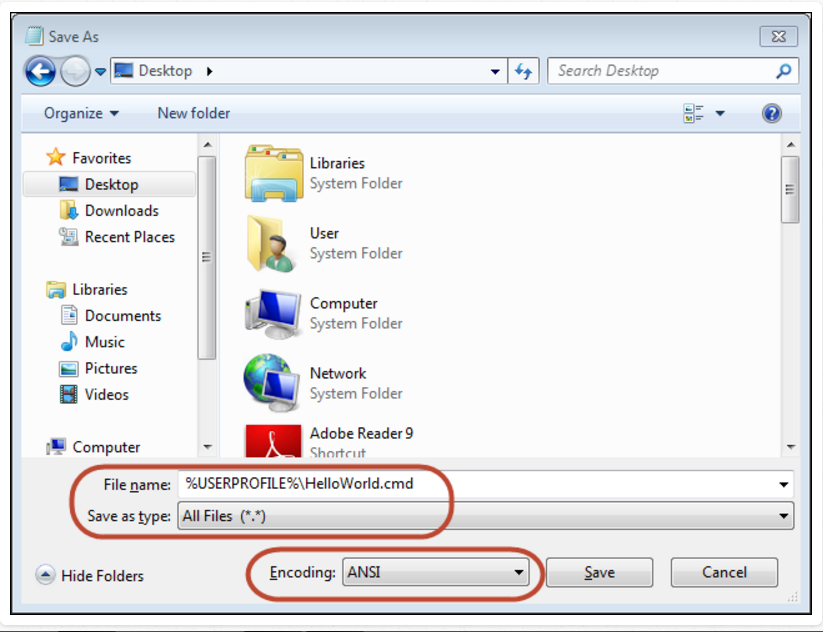

## 第1章 开始

##### 启动cmd
按下windows logo，输入cmd，然后按住Control+Shift再Enter，以管理员身份打开cmd


##### 使用Notepad++
百度notepad++下载即可，是windows上相当好用的文本编辑器

按下windows log，输入notepad再按下Enter，启动Notepad++

##### Batch后缀名
在xp以上windows系统中，推荐使用.cmd作为脚本文件名，.bat后缀也许会有些副作用。
文件名不要出现空格，可以出现连接符比如`. - _`，不要和系统内置脚本同名，不要和自己使用的三方脚本同名


##### 保存文件
不带后缀保存脚本文件



##### 运行脚本
双击脚本文件即可，不过一般脚本很快就会消失，看不到输出和错误，第十章我们再来解决这个问题

##### 添加脚本注释
REM或者::可以添加注释
```
REM 这是注释
:: 这也是个注释
```


##### 不输出脚本本身
需要开启@ECHO OFF
```
// test_echo.cmd
@ECHO OFF
:: this is a testing

echo "without echo"
ECHO ON

echo "with echo"
:: another testing
```
